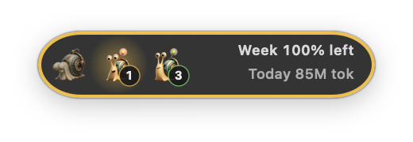
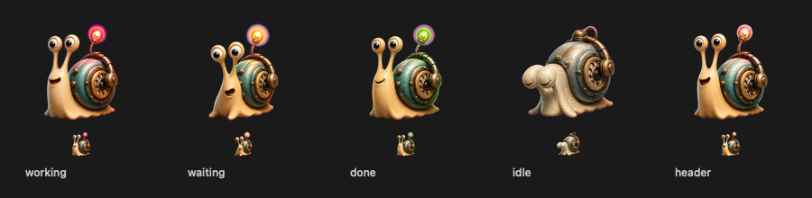
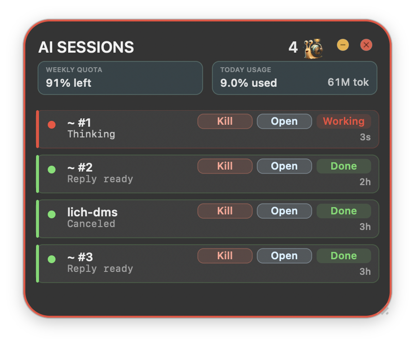

# Mushi Signal

<p align="center">
  
</p>

**Mushi Signal** 是一个 macOS 右下角常驻的 Codex 状态监控工具。它用电话虫风格的红、黄、绿状态提示，让你一眼看见当前所有 Codex 进程是在工作、等待你确认，还是已经完成。

## 核心体验

<p align="center">
  
</p>

默认状态下，Mushi Signal 会收起在屏幕右下角，只展示三只状态电话虫和额度信息：

- **红色电话虫**：Codex 正在 working，例如推理、搜索、调用工具、运行命令。
- **黄色电话虫**：Codex 正在 waiting，例如等待你确认命令、回答问题或授权操作。
- **绿色电话虫**：Codex 已完成，正在等待你的下一步输入。
- **灰色电话虫**：当前没有这个状态的进程。

## 状态电话虫

<p align="center">
  
</p>

状态设计参考了电话虫“接通”和“挂断”的感觉：有任务时电话虫直立并睁眼，空闲时变成灰色挂断状态。收起态固定显示三只电话虫，顺序为 **Working / Waiting / Done**，每只电话虫右下角会显示对应进程数量。

## 展开列表

<p align="center">
  
</p>

点击右下角窗口后会展开任务列表。列表会显示当前全部 Codex 进程，并按优先级排列：

1. **Waiting** 置顶，因为它需要你处理。
2. **Working** 紧随其后，因为它代表正在执行的任务。
3. **Done** 放在后面，作为已经完成的历史任务。
4. 同状态下，最近活跃的任务排在前面。

每个任务会显示项目名、当前状态、最近时间、任务摘要，并提供：

- **Open**：跳转到对应 Codex 终端或 IDE 窗口。
- **Kill**：关闭单个 Codex 进程，执行前会弹窗确认。

## 额度展示

Mushi Signal 会自动识别当前账户的额度类型：

- **周订阅账户**：显示本周剩余额度，例如 `Week 87% left`。
- **API 计费账户**：显示 API 总余额，例如 `API $16.41 left`。

今日使用量单独展示，例如 `Today 13% used` 或 `Today 53M tok`。周订阅和 API 会按当前日志中的账户计费记录自动切换，模型级别的单独限额不会被误当成账户总额度。

## 安装和启动

安装后，Mushi Signal 会作为 macOS 登录启动项运行。正常情况下不需要手动打开，登录后会自动出现在右下角。

如果需要手动启动，可以打开：

```text
/Applications/Mushi Signal.app
```

如果需要跳转到终端或 IDE 窗口，请在 macOS 设置中给 Mushi Signal 开启 **Accessibility** 权限。没有权限时，点击 Open 会弹出提示并引导你打开系统设置。

## 适合场景

- 同时开多个 Codex 任务，需要快速知道哪个任务在等你。
- Codex 正在运行命令，想确认它不是已经结束或卡住。
- 在多个项目之间切换，希望从任务列表直接跳回对应窗口。
- 想同时看到本周额度和今日使用情况。

## 文件位置

- App：`/Applications/Mushi Signal.app`
- 登录启动项：`~/Library/LaunchAgents/com.wuxing.mushi-signal.plist`
- 源码目录：`/Users/wuxing/ai-traffic-light`
